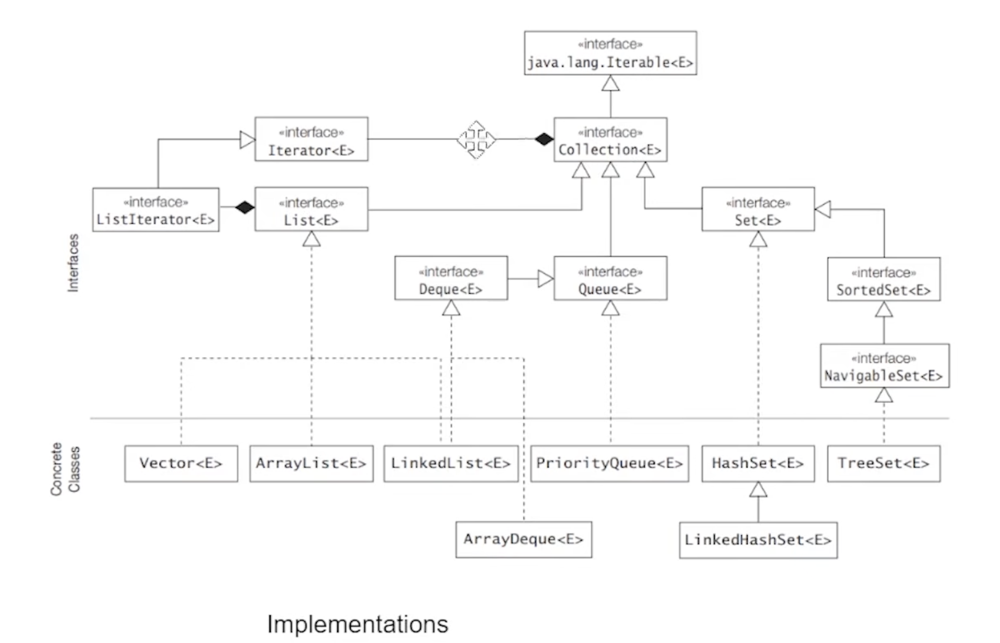
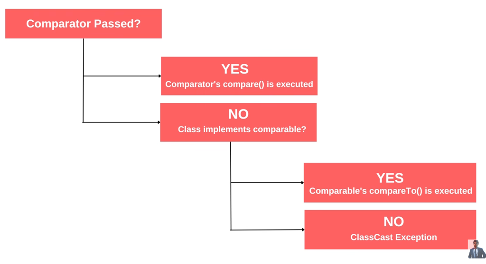

## To Practice
1. Implement a generic array as a custom collection and iterate over it.

## Notes

### Collection and Iterable interfaces
* A ForEach (enhanced-for) loop can only be applied to an instance of a class that implements the `Iterable` interface.
* Enhanced-for implicitly calls the `hasNext()` and `next()` methods (that are overridden by a nested class that implements an `Iterator` interface)
* `Collection` (interface) ---extends---> `Iterable` (interface)
* A class, supposedly a `CustomCollection` ---implements---> `Iterable` interface and a nested sub-class within the `CustomCollection` class, say `CustomIterator` ---implements---> `Iterator` interface and overrides the `hasNext()` and `next()` methods, in order to enable traversal using a for-each loop over the custom collection object. The `CustomIterator` maintains its own iteration variable, similar to `i` in a for loop.
* `Iterator` interface has 2 methods `hasNext()` and `next()`.

### List, ListIterator, Queue and Deque interfaces
* `ListIterator` interface extends `Iterator` interface and provides 2 additional methods `hasPrevious()` and `previous()`.
* `ListIterator` (interface) ---extends---> `Iterator` (interface)
* `ArrayList` and `Vector` -> mostly same except `Vector` is Thread Safe, and hence has a performance overhead compared to `ArrayList`
* `ArrayList`, `Vector` (concrete classes) ---implements---> `List` (interface) ---extends---> `Collection` (interface) ---extends---> `Iterable` (interface)
* `LinkedList` ---implements---> `List` and `Deque` interfaces
* Deque allows double ended operation on queues (add and remove from head and tail)
* `ArrayDeque` (concrete class) ---implements---> `Deque` (interface) ---extends---> `Queue` (interface) ---extends---> `Collection` (interface)
* `Stack` (concrete class) ---extends---> `Vector` (concrete class) ---implements---> `List` (interface)
* Queues -> FIFO (add to tail and remove from head), Stacks -> LIFO (add to head and remove from head)
* For <mark> implementing FIFO Queues </mark> -> use `LinkedList`
* For <mark>  implementing Stack (LIFO) </mark> -> use `ArrayDeque` as a standard practice (Stack class is legacy)
* For <mark> implementing Double ended queues </mark> -> use `ArrayDeque`
* Why ArrayDeque over stack?
  * You program ArrayDeque to an interface, unlike Stack (cleaner encapsulation and better design as it adheres strictly to Queue/Deque contracts. Stack exposes some stack principle violation methods -like add/remove from an arbitrary position due to inheritance)
  * Stack has a performance overhead due to synchronization (it extends Vector which is thread safe). ArrayDeque is faster.
  * ArrayDeque prohibits null elements unlike stack.
* Methods in Queue and Deque:
  * `add()` -> add to queue to tail, throws an exception if queue is full -> variations in Deque: `addFirst()`, `addLast()`
  * `offer()` -> <mark> add to queue to tail, no exception ---> **use this** -> variations in Deque:</mark> `offerFirst()`, `offerLast()`
  * `remove()` -> remove from queue from head, throws an exception if queue is empty -> variation in Deque: `removeFirst()`, `removeLast()`
  * `poll()` -> <mark> remove from queue from head, no exception  ---> **use this** -> variation in Deque: </mark> `pollFirst()`, `pollLast()`
  * `element()` -> to get element on top of the queue, throws exception if queue is empty
  * `peek()` -> <mark> to get element on top of the queue (current element), no exception ---> **use this** </mark>
  * `isEmpty()` -> <mark> method of collection interface, returns true if empty else false </mark>
* Methods in Stack:
  * `push()` -> add to stack to top/head -> exception if stack is full
  * `pop()` -> remove from stack from top/head -> exception if stack is empty
* Usage of double ended queues/ArrayDeque - 0-1 BFS
* Queues - not sortable, not indexable (with position like lists), iterable, traversal from head to tail
### PriorityQueue and Comparable interfaces
  * `PriorityQueue` (concrete class) ---implements---> `Queue` (interface)
  * Works on the priority of elements (rather than the order of insertion in case of a normal queue)
  * Implementation is based on a priority heap (a tree like structure)
  * Iterating over the priority queue does not guarantee the priority order. Hence, it is not a good practice to iterate over it.
  * But removal of elements guarantees elements to be removed in priority order.
  * In case of several elements having the same priority, one of them is chosen arbitrarily.
  * In order for implementing a priority queue containing elements of class  `TestClass`, the `TestClass` should implement the `Comparable` interface and override it's `compareTo()` method. That is, it should have some sort of basis for comparison. Else, exception is thrown.
### Comparator interface
  * Case example:
    * `Integer` class implements the `Comparable` interface and overrides its `compareTo()` -> this is called **Natural Ordering**
    * But the provided implementation is to sort integers in ascending order. That is, it uses a **min heap** (if sorting is to be done in descending order, pq uses a **max heap**).
    * In order to provide our own custom comparison contract, we define our own `CustomIntComparator` class implementing the `Comparator` interface and override its `compare()` method. 
    * Priority queue calls the `compareTo()` method by default. In order to make it use our `CustomIntComparator`, pass an instance of the `CustomIntComparator` class -> passing custom comparator to be used is called **Total Ordering**
    * Precedence: Total ordering > Natural ordering.
    * If CustomComparator passed -> use it and call `compare()` (pq does not check for the `TestClass` to implement `Comparable` interface), else -> (see if `TestClass` implements `Comparable` interface. if no -> throw error, else -> use `compareTo()`)
    * In other words, no need to implement `Comparable` interface if a `Comparator` object is passed, as precedence goes to the latter.
  * Custom comparators can be separate classes, anonymous inner class or lambdas
  * Priority queue just needs a comparison function. No need to explicitly define a class to implement the comparator interface. Hence, we can use lambda functions to achieve the same.
  * Comparator is a functional interface (having only 1 abstract method - compare()) and hence lambda function can be used to define method implementation and instantiation.
  * Comparator has higher precedence and will always override the Comparable.

### Set interface
* Set is a unique collection of elements. Duplicate insertions are dropped.
* Insertion and retrieval take constant time.
* Unordered and not sortable.
* Set methods -
  * `containsAll()`
  * `addAll()` - union
  * `removeAll()` - set difference
  * `retainAll()` - intersection
  * `clear()`
* The Set on which the above methods are invoked gets modified.
* `HashSet` (concrete class), `LinkedHashSet` (concrete class) ---implements---> `Set` (interface)
* `HashSet` uses a hash-table structure. It does not maintain insertion order.
* `LinkedHashSet` maintains insertion order with the help of the hash-table combined with an internal doubly linkedlist behind the scenes. It doesn't maintain order to provide positional access. It maintains order so its iteration order is predictable.
* **Internal working of a Hashset and Hash collision**:
  * HashSet is internally backed by a HashMap.
  * Internally, the hash table contains an array of slots called buckets. A bucket is simply one position in this array where entries are stored.
  * When an element is inserted, its hashCode() is used to determine the appropriate bucket.
  * Multiple elements can map to the same bucket even if their hash codes are different. This is called a **hash collision**.
  * Colliding entries are initially maintained as a linked structure; in modern Java, a heavily populated bucket can be converted to a red-black tree. 
  * When add() or contains() is called, the hash is used to locate the appropriate bucket, and equals() is then used to determine whether the target element is actually present. If yes, add will not happen and contains return true.
  * For custom classes, if equality should be based on member values rather than object identity, equals() and hashCode() must be overridden consistently because HashSet uses hashCode() to locate the bucket and equals() to determine equality within that bucket. If equal objects produce different hash codes, the set may fail to find an object that is logically equal. The core property of set to not contain duplicates may not hold as we expect.
  * If two objects are equal according to equals(), they must have the same hash code. However, two objects having the same hash code does not mean they are equal.
* 
