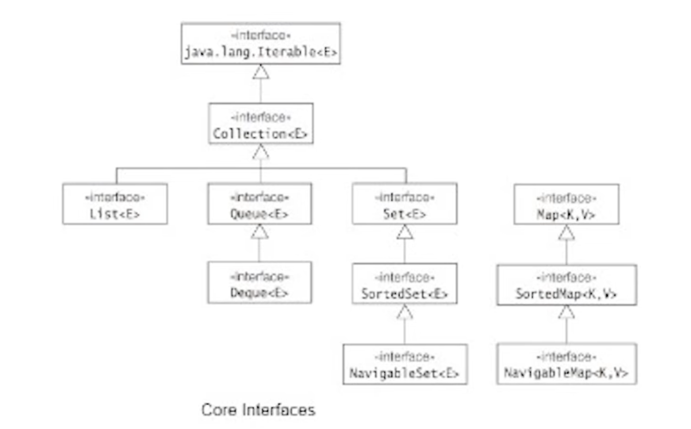

## To Practice
1. Implement a generic array as a custom collection and iterate over it.

## Notes
* A ForEach (enhanced-for) loop can only be applied to an instance of a class that implements the `Iterable` interface.
* Enhanced-for implicitly calls the `hasNext()` and `next()` methods (that are overridden by a nested class that implements an `Iterator` interface)
* `Collection` (interface) ---extends---> `Iterable` (interface)
* A class, supposedly a `CustomCollection` ---implements---> `Iterable` interface and a nested sub-class within the `CustomCollection` class, say `CustomIterator` ---implements---> `Iterator` interface and overrides the `hasNext()` and `next()` methods, in order to enable traversal using a for-each loop over the custom collection object. The `CustomIterator` maintains its own iteration variable, similar to `i` in a for loop.
* `Iterator` interface has 2 methods `hasNext()` and `next()`. It is extended by the `ListIterator` interface which provides 2 additional methods `hasPrevious()` and `previous()`.
* `ListIterator` (interface) ---extends---> `Iterator` (interface)
* `ArrayList` and `Vector` -> mostly same except `Vector` is Thread Safe, and hence has a performance overhead compared to `ArrayList`
* `ArrayList`, `Vector` (concrete classes) ---implements---> `List` (interface) ---extends---> `Collection` (interface) ---extends---> `Iterable` (interface)
* `LinkedList` ---implements---> `List` and `Deque` interfaces
* Deque allows double ended operation on queues (add and remove from head and tail)
* `ArrayDeque` (concrete class) ---implements---> `Deque` (interface) ---extends---> `Queue` (interface) ---extends---> `Collection` (interface)
* `Stack` (concrete class) ---extends---> `Vector` (concrete class) ---implements---> `List` (interface)
* Queues -> FIFO (add to tail and remove from head), Stacks -> LIFO (add to head and remove from head)
* For <mark> implementing FIFO Queues </mark> -> use `LinkedList`
* For <mark>  implementing Stack (LIFO) </mark> -> use `ArrayDeque` as a standard practice (Stack class is legacy)
* For <mark> implementing Double ended queues </mark> -> use `ArrayDeque`
* Why ArrayDeque over stack?
  * You program ArrayDeque to an interface, unlike Stack (cleaner encapsulation and better design as it adheres strictly to Queue/Deque contracts. Stack exposes some stack principle violation methods -like add/remove from an arbitrary position due to inheritance)
  * Stack has a performance overhead due to synchronization (it extends Vector which is thread safe). ArrayDeque is faster.
  * ArrayDeque prohibits null elements unlike stack.
* Methods in Queue and Deque:
  * `add()` -> add to queue to tail, throws an exception if queue is full -> variations in Deque: `addFirst()`, `addLast()`
  * `offer()` -> <mark> add to queue to tail, no exception ---> **use this** -> variations in Deque:</mark> `offerFirst()`, `offerLast()`
  * `remove()` -> remove from queue from head, throws an exception if queue is empty -> variation in Deque: `removeFirst()`, `removeLast()`
  * `poll()` -> <mark> remove from queue from head, no exception  ---> **use this** -> variation in Deque: </mark> `pollFirst()`, `pollLast()`
  * `element()` -> to get element on top of the queue, throws exception if queue is empty
  * `peek()` -> <mark> to get element on top of the queue (current element), no exception ---> **use this** </mark>
  * `isEmpty()` -> <mark> method of collection interface, returns true if empty else false </mark>
* Methods in Stack:
  * `push()` -> add to stack to top/head -> exception if stack is full
  * `pop()` -> remove from stack from top/head -> exception if stack is empty
* Usage of double ended queues/ArrayDeque - 0-1 BFS
* Queues - not sortable, not indexable (with position like lists), iterable, traversal from head to tail
* Priority queue
* 

